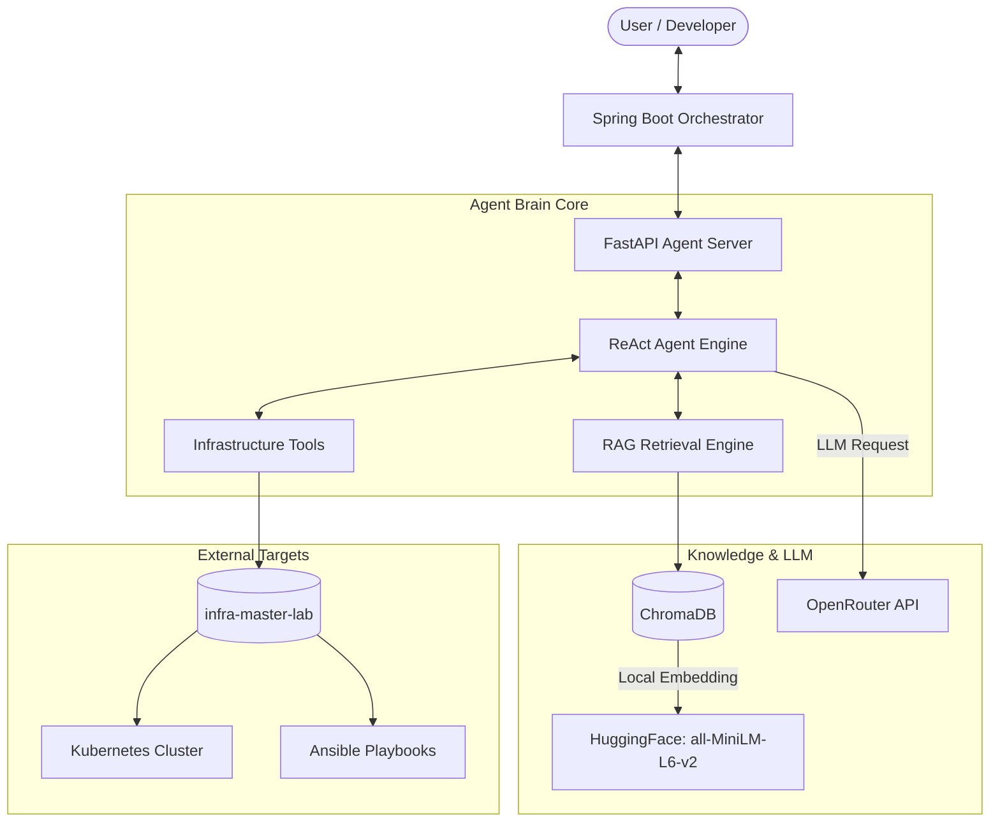

<div align="center">
  
</div>

# 🧠 ai-agent-brain-lab: AI Agent & RAG Architecture

> AI를 백엔드 시스템 안에 어떻게 통합하고 자율적으로 작동하게 할 것인지 증명합니다.

<div align="center">
  [](https://www.python.org/)
  [](https://www.langchain.com/)
  [](https://fastapi.tiangolo.com/)
  [](https://github.com/hooneyg/ai-agent-brain-lab/actions)
  [](https://opensource.org/licenses/MIT)
</div>

---

## 📌 1. Problem — 왜 만들었는가

마이크로서비스 인프라의 규모가 커짐에 따라, 장애 발생 시 원인을 파악하고 조치하는 데 걸리는 시간(MTTR)이 증가합니다. 기존의 정적 알람 스크립트로는 복합적인 에러 상황에 유연하게 대처할 수 없습니다.

따라서 사람의 개입 없이, **인프라 상태를 직접 진단하고 RAG 문서를 기반으로 해결책을 추론하여 조치**하는 자율적인 에이전트 브레인이 필요합니다. 이 랩은 Java/Spring 기반의 오케스트레이터와 Python 기반의 AI 에이전트를 어떻게 통합할 수 있는지 증명합니다.

---

## 🏗️ 2. Architecture — 어떻게 설계했는가



---

## 📂 3. Project Structure — 어디에 무엇이 있는가

```text
ai-agent-brain-lab/
├── agent-core/          # Python FastAPI 기반 AI 에이전트 코어
│   ├── main.py          # FastAPI 진입점
│   ├── requirements.txt # Python 의존성
│   └── tests/           # 에이전트 코어 테스트
├── agent-orchestrator/  # Java Spring Boot 기반 API 게이트웨이 및 오케스트레이션
│   └── src/
├── docs/                # 아키텍처 및 트러블슈팅 문서
├── examples/            # API 요청 및 응답 샘플
└── docker-compose.yml   # 전체 스택 실행을 위한 컨테이너 설정
```

---

## 🎯 4. Key Features & Evidence — 무엇을 증명하는가

- **Java/Python Hybrid Architecture**: Spring Boot 오케스트레이터와 FastAPI 에이전트를 분리하여 확장을 용이하게 했습니다.
- **Autonomous Reasoning (ReAct Pattern)**: ReAct(Reason + Act) 패턴을 통해 복합 문제를 스스로 해결합니다.
- **Context-Aware RAG**: 로컬 임베딩 모델(HuggingFace)과 ChromaDB를 활용해 사내 인프라 기술 문서를 검색합니다.
- **Provider Agnostic LLM**: OpenRouter API를 연동하여 특정 LLM 벤더(OpenAI, Anthropic 등)에 종속되지 않습니다.

---

## 🚀 5. Quick Start — 어떻게 실행하는가

### Environment Setup (Python Agent Core)
```bash
cd agent-core
python -m venv venv
# Windows: .\venv\Scripts\Activate.ps1
# Mac/Linux: source venv/bin/activate
pip install -r requirements.txt
```

### Configuration (`agent-core/.env`)
```env
OPENROUTER_API_KEY=[OPEN_AI_API_KEY]
OPENROUTER_BASE_URL=https://openrouter.ai/api/v1
OPENROUTER_MODEL=openai/gpt-4o
INFRA_DOCS_PATH=../docs
```

### Running the Server
```bash
# Agent Core 실행
cd agent-core
python main.py
```

---

## 🧪 6. Tests — 어떻게 검증했는가

Python `agent-core` 테스트 (RAG 검색 흐름 및 ReAct 추론 검증):
```bash
cd agent-core
pytest tests/
```

Java `agent-orchestrator` 테스트 (통신 장애 Fallback 및 타임아웃 검증):
```bash
cd agent-orchestrator
./gradlew test
```

---

## 📚 7. Documentation — 더 깊게 볼 문서

- [🛠️ Troubleshooting Guide](./docs/troubleshooting.md): RAG 문서 인덱싱 누락 및 의존성 충돌 해결 기록
- [📘 Tech Wiki: ReAct Agent Engine](./docs/decisions/ADR-001-react-agent-engine.md): ReAct 엔진 설계 및 결정 사항

---

## 🧭 8. Roadmap — 다음 보완 계획

- [ ] ChromaDB 연동 최적화 및 pgvector 이관 검토
- [ ] Prompt Template Versioning 적용
- [ ] LLM Response Tracing (OpenTelemetry 또는 LangSmith 연동)
- [ ] TOP 6 LAB 전체 문서를 검색하는 Lab Assistant 기능 확장

---

## 🔗 9. Related Labs — TOP 6 안에서 어떻게 연결되는가

| Related Lab | 연결 이유 |
| --- | --- |
| `infra-master-lab` | 에이전트가 관리하고 모니터링할 인프라 환경의 기준 제공 |
| `security-auth-core` | AI API 호출 및 오케스트레이터 통신의 인증/인가 기준 |
| `database-master-lab` | 대규모 로그 및 상태 저장을 위한 성능 최적화 기준 |
| `event-streaming-lab` | AI 비동기 태스크 처리와 알람 전달의 이벤트 기준 |
| `realtime-comm-lab` | 사용자와 챗봇 형식의 실시간 소통을 위한 연결 기준 |

---

## 📄 10. License

This project is licensed under the [MIT License](./LICENSE).

---
<div align="center">
<b>Built with ❤️ by <a href="https://github.com/hooneyg">Hooney</a> — AI FullStack Developer & Enterprise Solution Architect</b>


</div>
