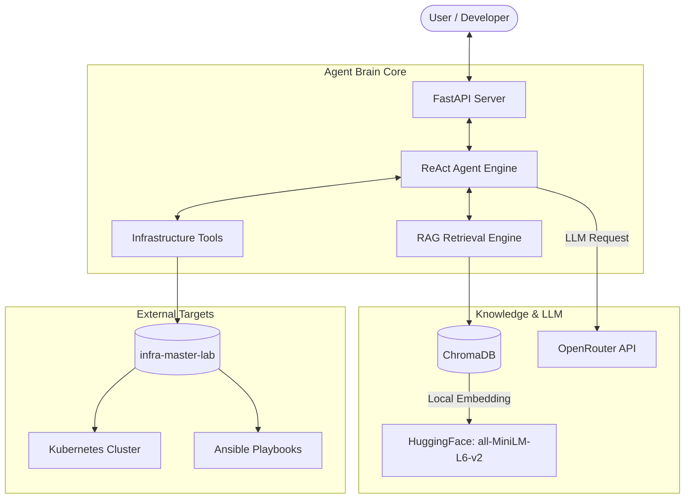

<div align="center">
  
</div>

# 🧠 AI Agent Brain Lab: The Era of Autonomous Reasoning

<div align="center">
  <p><i>"Self-Healing Infrastructure through Autonomous AI Reasoning"</i></p>

  [](https://www.python.org/)
  [](https://www.langchain.com/)
  [](https://fastapi.tiangolo.com/)
  [](https://github.com/hooneyg/ai-agent-brain-lab)
  [](https://github.com/hooneyg/ai-agent-brain-lab/actions)
  [](https://opensource.org/licenses/MIT)
</div>

---

## 📌 1. Problem (해결하고자 하는 문제)
마이크로서비스 인프라의 규모가 커짐에 따라, 장애 발생 시 원인을 파악하고 조치하는 데 걸리는 시간(MTTR)이 기하급수적으로 증가합니다.
- 기존의 정적 알람 스크립트로는 복합적인 에러 상황에 유연하게 대처할 수 없습니다.
- 사람의 개입 없이, **인프라 상태를 직접 진단하고 RAG 문서를 기반으로 해결책을 추론하여 조치**하는 자율적인 에이전트 브레인이 필요합니다.

---

## 🏛️ 2. Project Overview (프로젝트 개요)
**AI Agent Brain Lab**은 마이크로서비스 생태계에 자율적인 사고 능력을 부여하는 **지능형 에이전트의 중추**를 개발하는 프로젝트입니다. `infra-master-lab`에서 구축한 인프라를 스스로 분석하고, 자연어 질의를 통해 인프라 상태를 진단하며 조치하는 **Self-Healing AI**를 목표로 합니다.

---

## 📐 System Architecture



---

## ✨ Key Features
- **Autonomous Reasoning**: ReAct(Reason + Act) 패턴을 통한 복합 문제 해결 및 계획 수립
- **Context-Aware RAG**: 로컬 임베딩 모델을 활용한 고효율 인프라 기술 문서 기반 검색
- **Multi-Tool Integration**: 인프라 상태 조회 및 복구 스크립트 생성을 위한 커스텀 도구 지원
- **Clean Architecture**: 확장성을 고려한 계층형 구조 및 정밀한 로깅 시스템

---

## 🛠️ Technology Stack
- **Framework**: FastAPI (Python 3.11+)
- **LLM Orchestration**: LangChain, LangChain-OpenAI
- **LLM Provider**: OpenRouter (GPT-4o, Claude 3.5 Sonnet 등 가변 모델 지원)
- **Vector Store**: ChromaDB
- **Embeddings**: HuggingFace (Local Execution)

---

## 🚀 Quick Start

### 1. Environment Setup
```bash
cd agent-core
python -m venv venv
source venv/bin/activate  # Windows: .\venv\Scripts\Activate.ps1
pip install -r requirements.txt
```

### 2. Configuration (.env)
```env
OPENROUTER_API_KEY=your_key_here
OPENROUTER_BASE_URL=https://openrouter.ai/api/v1
OPENROUTER_MODEL=openai/gpt-4o
INFRA_DOCS_PATH=d:/works/20260508/infra-master-lab
```

### 3. Running the Server
```bash
python main.py
```

### 4. API Testing
- **Ingest**: `curl -X POST http://localhost:8000/ingest`
- **Ask**: `curl -X POST http://localhost:8000/ask -H "Content-Type: application/json" -d "{\"query\": \"인프라 노드 상태 점검해줘.\"}"`

## 🔗 Related Labs & Documentation

### 📚 기술 및 아키텍처 문서
- [🛠️ Troubleshooting Guide](./docs/troubleshooting.md) - RAG 문서 인덱싱 누락 및 의존성 충돌 해결 기록
- [📘 Tech Wiki: ReAct Agent Engine](./docs/decisions/ADR-001-react-agent-engine.md)

### 🌐 6 Master Labs Series
- 🔒 [security-auth-core](../security-auth-core) - 완벽한 Stateless 인증 및 하이브리드 암호화
- 🏗️ [infra-master-lab](../infra-master-lab) - Zero Trust 엣지 및 Hexagonal 인프라
- 🗄️ [database-master-lab](../database-master-lab) - 데이터베이스 최적화 및 안정성
- ⚡ [realtime-comm-lab](../realtime-comm-lab) - 실시간 통신 및 웹소켓
- 🚀 [event-streaming-lab](../event-streaming-lab) - 분산 이벤트 스트리밍 시스템
- 🧠 **ai-agent-brain-lab (Current)** - AI Agent RAG 및 LLM 인퍼런스 코어

---

## 📝 License
This project is licensed under the [MIT License](./LICENSE).

---
<div align="center">
<b>Built with ❤️ by <a href="https://github.com/hooneyg">Hooney</a> — AI FullStack Developer & Enterprise Solution Architect</b>


</div>
