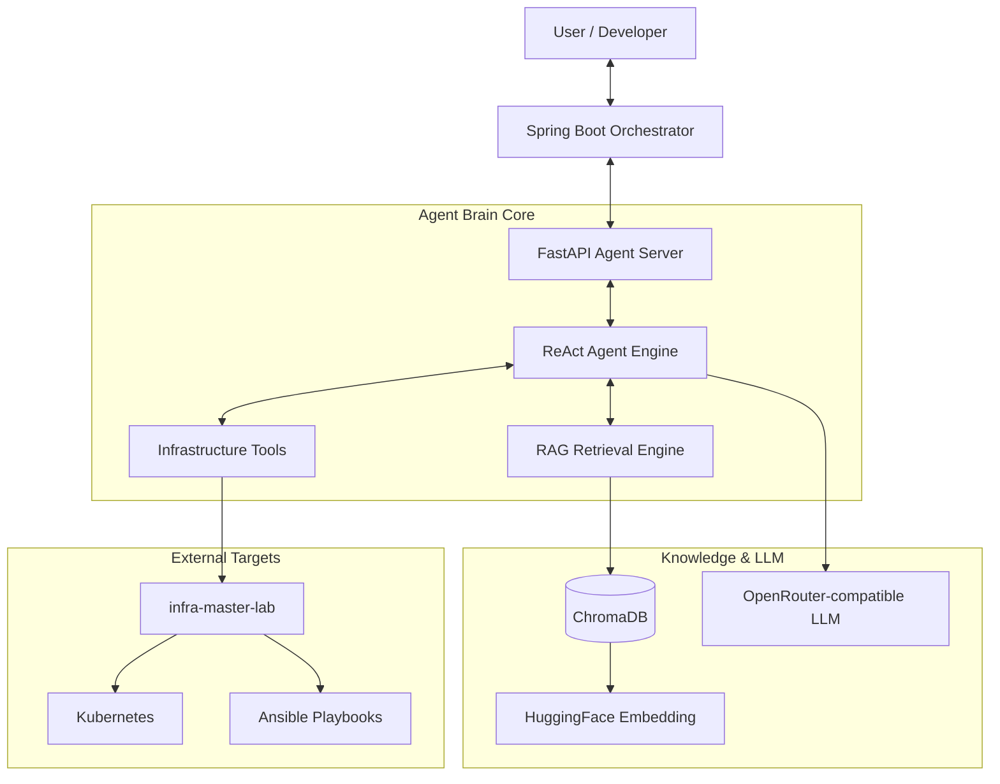

<div align="center">


<h3>🧠 Java/Python Hybrid AI Agent, RAG Retrieval, and Infrastructure Automation Lab</h3>

<p>
  
  
  
  
  
</p>

<p>
  
  
</p>

</div>

---

> 인프라 운영 지식, 기술 문서, 도구 실행 능력을 AI Agent 안에 통합하는 연구소입니다.  
> Spring Boot 오케스트레이터와 FastAPI Agent Core를 분리하고, ReAct 추론과 RAG 검색을 통해 복합 장애 진단과 자동화 조치를 실험합니다.

---

## 📌 Problem — 왜 만들었는가

- **운영 지식 파편화**: 장애 대응 절차, 인프라 문서, 로그 분석 기준이 여러 문서와 사람에게 흩어져 있습니다.
- **MTTR 증가**: 마이크로서비스와 인프라 규모가 커질수록 원인 파악과 조치 시간이 길어집니다.
- **정적 알람의 한계**: 단순 threshold 알람은 복합 원인 분석과 다음 조치 제안까지 수행하지 못합니다.
- **LLM 도입 경계 불명확**: AI가 추론하는 영역과 실제 도구를 실행하는 영역을 분리해야 운영 안정성을 확보할 수 있습니다.

AI Agent Brain Lab은 Java/Spring 기반 오케스트레이션과 Python/FastAPI 기반 Agent Core를 결합해, RAG 기반 지식 검색과 Tool 기반 실행을 분리한 AI 운영 자동화 구조를 제시합니다.

## 🏗️ Architecture — 어떻게 설계했는가



## 📂 Project Structure

```text
ai-agent-brain-lab/
├── agent-core/                                # 🧠 Python FastAPI 기반 Agent Brain Core
│   ├── main.py                                # 🚀 FastAPI 서버 진입점
│   ├── requirements.txt                       # 📦 LangChain, FastAPI, ChromaDB 의존성
│   └── tests/                                 # 🧪 RAG 검색, ReAct 추론, tool 흐름 테스트
├── agent-orchestrator/                        # 🌐 Java Spring Boot API orchestration 계층
│   └── src/                                   # 🛡️ API 경계, timeout, fallback 처리
├── docs/                                      # 📚 RAG 인덱싱 대상 ADR/운영 문서
├── examples/                                  # 🧾 Agent 요청/응답 샘플
└── docker-compose.yml                         # 🐳 Agent Core, Vector DB 통합 실행 환경
```

## 🎯 Key Features & Evidence — 무엇을 증명하는가

### 1. Java/Python Hybrid Agent Architecture

| Component | Responsibility |
| :--- | :--- |
| **Spring Boot Orchestrator** | API 진입점, 인증/인가 연계, timeout/fallback 처리 |
| **FastAPI Agent Core** | ReAct 추론, RAG 검색, tool execution orchestration |
| **HTTP Boundary** | 언어와 런타임을 분리해 독립 배포와 장애 격리 가능 |

**Evidence**

- Java 서비스와 Python Agent를 분리해 각 생태계의 장점을 활용합니다.
- 오케스트레이터 테스트로 agent-core 장애, timeout, fallback 흐름을 검증합니다.

### 2. ReAct Reasoning Engine

| Feature | Description |
| :--- | :--- |
| **Reason + Act Loop** | 문제 분석, 도구 선택, 결과 해석을 반복하는 agent 흐름 |
| **Tool Boundary** | 실제 인프라 조치 도구와 LLM 추론을 명시적으로 분리 |
| **Traceable Steps** | Agent가 어떤 문서를 찾고 어떤 도구를 선택했는지 추적 가능 |

**Evidence**

- Python `agent-core` 테스트로 RAG 검색과 ReAct 추론 흐름을 검증합니다.
- 도구 실행 경계를 분리해 LLM이 직접 운영 환경을 변경하지 않도록 설계합니다.

### 3. Context-aware RAG Retrieval

| Feature | Description |
| :--- | :--- |
| **Local Embedding** | HuggingFace embedding으로 내부 문서를 벡터화 |
| **ChromaDB** | 장애 대응 문서, ADR, troubleshooting 문서를 검색 가능한 지식으로 저장 |
| **Infra Docs Path** | `infra-master-lab` 등 연구소 문서를 agent context로 활용 |

**Evidence**

- 문서 기반 답변을 생성해 hallucination 가능성을 줄입니다.
- 운영 문서가 업데이트되면 agent의 지식 기반도 함께 확장될 수 있습니다.

### 4. Provider-agnostic LLM Gateway

| Feature | Description |
| :--- | :--- |
| **OpenRouter-compatible API** | 특정 LLM 벤더에 고정되지 않는 호출 구조 |
| **Model Switch** | 모델 변경을 환경 변수로 관리 |
| **Fallback Ready** | provider 장애 시 대체 모델 또는 fallback 응답으로 확장 가능 |

**Evidence**

- `.env` 설정으로 base URL과 model을 분리해 실험과 운영 전환을 쉽게 만듭니다.

## 🚀 Quick Start — 어떻게 실행하는가

### Python Agent Core

```bash
git clone https://github.com/hooneyg/ai-agent-brain-lab.git
cd ai-agent-brain-lab/agent-core

python -m venv venv
./venv/Scripts/Activate.ps1
pip install -r requirements.txt
python main.py
```

### Configuration

```env
OPENROUTER_API_KEY=your_openrouter_api_key
OPENROUTER_BASE_URL=https://openrouter.ai/api/v1
OPENROUTER_MODEL=openai/gpt-4o
INFRA_DOCS_PATH=../docs
```

### Java Orchestrator

```bash
cd ../agent-orchestrator
./gradlew bootRun
```

## 🧪 Tests — 어떻게 검증했는가

```bash
cd agent-core
pytest tests/

cd ../agent-orchestrator
./gradlew test
```

| Test Target | What It Proves |
| :--- | :--- |
| RAG retrieval | 문서 검색과 context 구성 |
| ReAct flow | 추론, 도구 선택, 결과 해석 흐름 |
| Orchestrator fallback | Agent 서버 장애와 timeout 대응 |
| API contract | Java/Python 경계의 요청/응답 스펙 |

## 🧭 Roadmap

- [ ] ChromaDB 연동 최적화 및 pgvector 이관 검토
- [ ] Prompt Template Versioning 적용
- [ ] LLM Response Tracing
- [ ] OpenTelemetry 또는 LangSmith 연동
- [ ] TOP 6 Lab 전체 문서를 검색하는 Lab Assistant 확장

## 🔗 Related Labs

| Related Lab | 연결 이유 |
| :--- | :--- |
| `infra-master-lab` | Agent가 진단하고 조치할 인프라 기준 |
| `security-auth-core` | AI API 호출과 오케스트레이터 통신의 인증/인가 기준 |
| `database-master-lab` | 로그, 상태, 벡터 저장소의 성능 기준 |
| `event-streaming-lab` | 비동기 AI task와 알림 이벤트 기준 |
| `realtime-comm-lab` | 사용자와 AI Agent 간 실시간 대화 채널 기준 |

## 📚 Documentation

- [Troubleshooting Guide](./docs/troubleshooting.md)
- [ADR-001: ReAct Agent Engine](./docs/decisions/ADR-001-react-agent-engine.md)

## 📄 License

This project is licensed under the [MIT License](./LICENSE).

---

<div align="center">
<b>Built by <a href="https://github.com/hooneyg">Hooney</a> — AI FullStack Developer & Enterprise Solution Architect</b>


</div>
